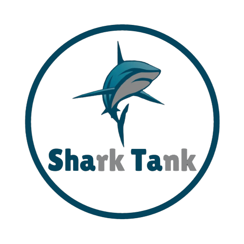

# Shark Tank College Project

## Overview

Shark Tank is an exciting college project associated with JGEC, aimed at creating a dynamic web application using Next.js. This project leverages various technologies to build a powerful and responsive platform.

## Technologies Used

- **Next.js:** A React framework that enables server-side rendering and other optimizations for React applications.

- **TypeScript:** A superset of JavaScript that adds static types, enhancing code quality and developer productivity.

- **Redux-Tool-Kit:** A javascript library for state management

## How to Run

1. Clone the repository.

```
git clone https://github.com/Darkrider0007/Shark-Tank.git
```

2. Install dependencies using

```
npm install
```

3. Add environment variables in `.env.local` file. Make sure this file must created into root directory

```
NEXT_PUBLIC_APPWRITE_URL=""
NEXT_PUBLIC_APPWRITE_PROJECT_ID=""
NEXT_PUBLIC_APPWRITE_DATABASE_ID=""
NEXT_PUBLIC_APPWRITE_COLLECTION_ID=""
NEXT_PUBLIC_APPWRITE_BUCKET_ID=""
NEXT_PUBLIC_APPWRITE_DATABASE_ID_USERS=""
NEXT_PUBLIC_APPWRITE_COLLECTION_ID_USERS=""
NEXT_PUBLIC_EMAILJS_SERVICE_ID=""
NEXT_PUBLIC_EMAILJS_PUBLIC_KEY =""
NEXT_PUBLIC_EMAILJS_TEMPLATE_ID = ""
```

4. Run the development server using

```
npm run dev
```

5. Open [http://localhost:3000](http://localhost:3000) with your browser to see the result.

## Test Email and Password

```
Email:test@mail.com
Password:12345678
```
## Team Members

- [Neha Panda](https://www.github.com/Neha00011)
- [Rohan Gope](https://www.github.com/Darkrider0007)
- [Saikat Samanta](https://www.github.com/psykat1116)


# License

This project is licensed under the GNU General Public License v2.0 (GPL-2.0). See the LICENSE file for details.

